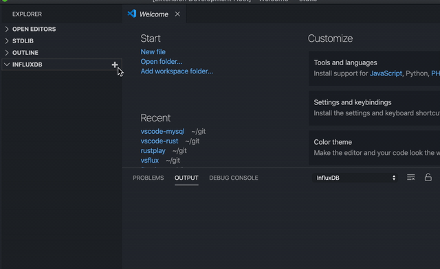

# VSCODE FLUX

Flux is a lightweight scripting language for querying databases (like InfluxDB) and working with data. It's part of InfluxDB 1.7 and 2.0, but can be run independently of those. This repo represents the language definition and an implementation of the language core.

## Developer Setup

1. Install flux-lsp

```bash
   cargo install --git git@github.com:influxdata/flux-lsp.git
```

2. Install influx cli

```bash
    go get github.com/influxdata/influxdb
    go install $GOPATH/src/github.com/influxdata/influxdb/cmd/influx
```

3. get the vscode plugin

```bash
    git clone https://github.com/influxdata/vsflux
    cd !$
    code .
```

Inside vscode, click `F5`, to launch the vscode with client

## Add InfluxDB Connection


